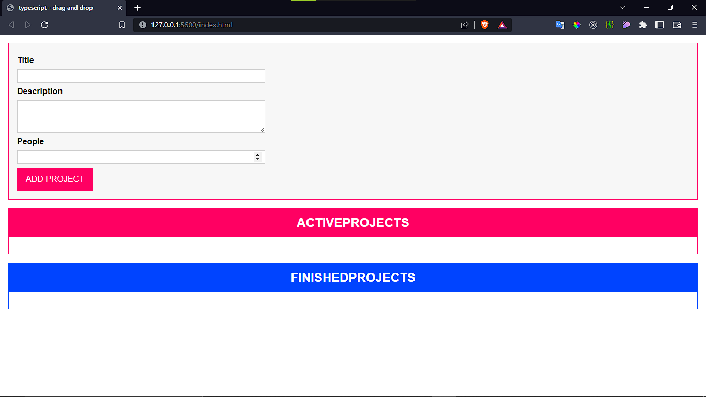
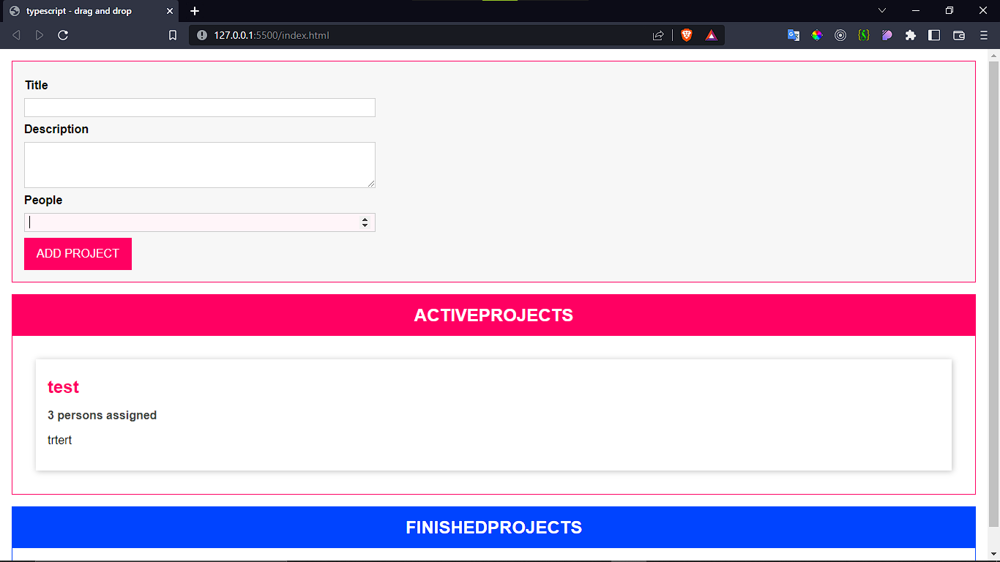

# project drag and drop using typescirpt
it's a simple drag and drop project to practice OOP(object oriented programming) using typescript

## functionality
1. user can create a project with active as initial status
2. drag and drop a project from active to finished and vise versa

### home page

### adding a project

this example inspired by Maxmilian typescript course